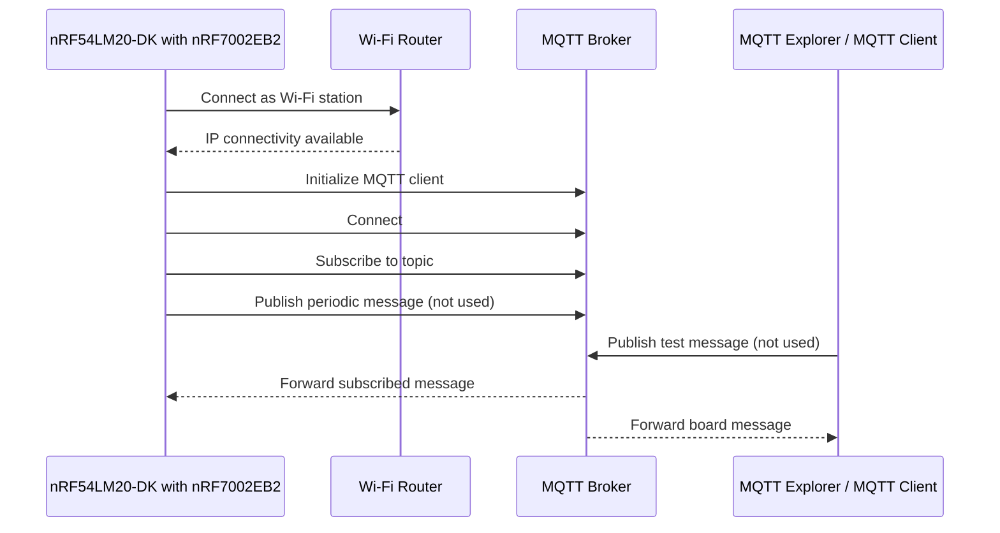
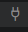

# former nRF7002 MQTT Client Example
# rewritten for a nRF54LM20-DK (by Paulus Schulinck (Github @PaulskPt))

<div align="center">

**Wi-Fi MQTT client example for the Nordic Semiconductor nRF54LM20-DK with nRF7002EB2 Wi-Fi board, using Zephyr and the nRF Connect SDK.**

Connect the **nRF54LM20-DK** to a Wi-Fi network, establish an **MQTT client session**, subscribe to a topic from an embedded C application and print certain data to a display.

<br>

For info about the origin of this modified project:
[Read the full technical article](https://abluethinginthecloud.com/nrf7002-mqtt-client-example/) ·
[Visit A Blue Thing In The Cloud](https://abluethinginthecloud.com/) ·
[YouTube channel](https://www.youtube.com/@abluethinginthecloud)
[Changes in 2026 by Paulus Schulinck (Github @PaulskPt)](https://www.github.com/PaulskPt/nrf7002-mqtt-client)

</div>

---

## Overview

This repository contains an embedded **MQTT client example, in 2026 adapted for the Nordic nRF54LM20-DK with nRF54LM20B and a nRF7002EB2**.

The application configures the board as a **Wi-Fi station**, connects to a Wi-Fi access point, establishes an MQTT session with a broker, subscribes to a configurable topic, filters certain message contents and presents the data to a display.

It is a practical starting point for IoT products that need Wi-Fi cloud connectivity, such as:

- Wireless sensors
- Smart home devices
- Industrial monitoring nodes
- MQTT telemetry devices
- Wi-Fi connected prototypes
- nRF7002 proof-of-concepts
- Zephyr-based IoT applications

The project is written mainly in **C** and uses the **Zephyr / nRF Connect SDK** build system.

---

## What this example does

The firmware performs the following sequence:

1. Initializes the board and application modules;
2. Configures the nRF54LM20-DK with nRF7002EB2 as a Wi-Fi station;
3. Connects to the configured Wi-Fi network;
4. Indicates Wi-Fi connection status using the board's LED1;
5. Initializes the MQTT client;
6. Indicates MQTT connection status by fading the board's LED2;
6. Connects to a configured local MQTT broker;
7. Subscribes to the configured MQTT topic;
8. Publishes a configurable message periodically (this feature is not used in this version of this project);
9. Handles MQTT callbacks for connection, disconnection, incoming messages;
10. Disconnects from MQTT if the Wi-Fi connection is lost however the app will try to restore both.

---

## Application flow



---

## Repository structure

```text
nrf7002-mqtt-client-example/
├── boards/             # Board-specific configuration
├── src/
│   ├── common/         # Common application files
│   └── modules/        # Application modules
│       ├── error/      # Error handling module
│       ├── led/        # Optional LED module
│       ├── display/    # Optional I2C OLED
│       ├── network/    # Wi-Fi / network handling
│       ├── sampler/    # Payload/sample generation
|       ├── telemetry/  # Communicates MQTT connection status
│       ├── transport/  # MQTT transport layer
│       └── trigger/    # Periodic trigger logic
├── CMakeLists.txt      # Zephyr build configuration
├── Kconfig             # Application Kconfig options
├── prj.conf            # Main application configuration
├── sample.yaml         # Zephyr/NCS sample metadata
├── LICENSE
└── README.md
```

---

## Hardware requirements

| Component | Description |
|---|---|
| **nRF54LM20-DK** | Nordic Semiconductor development kit with external WiFi-board: nRF7002EB2 and nRF5340 host processor |
| **Wi-Fi access point** | Router or access point with Internet/network access |
| **USB cable** | For programming, power and serial log output |
| **Development PC** | Linux, macOS or Windows environment with nRF Connect SDK tools |

The nRF54LM20-DK is designed for Wi-Fi 6 IoT development and combines the nRF7002 Wi-Fi companion IC with an nRF5340 host SoC.

---

## Software requirements

You need a working Nordic / Zephyr development environment.

Recommended tools:

- **nRF Connect SDK**
- **Zephyr west tool**
- **nRF Command Line Tools**
- **nRF Connect for Desktop**
- **Visual Studio Code with extension: `nRF Connect for VS Code`**, or another Zephyr-compatible workflow
- **MQTT Explorer** or another MQTT client for testing
- **PuTTY**, a free SSH and Telnet Client with Terminal emulator.

For the full setup process, see:

[Getting started with nRF54LM20-DK](https://abluethinginthecloud.com/getting-started-with-nrf7002/)

---

## Configuration

Before building the firmware, edit:

```text
prj.conf
```

The most important configuration options are grouped into two areas: Wi-Fi station configuration and MQTT client configuration.

---

### Wi-Fi configuration

Set the Wi-Fi network credentials:

```conf
CONFIG_WIFI_CREDENTIALS_STATIC_SSID="your_wifi_ssid"
CONFIG_WIFI_CREDENTIALS_STATIC_PASSWORD="your_wifi_password"
```

Select the Wi-Fi security mode used by your router. For example, WPA2:

```conf
CONFIG_STA_KEY_MGMT_WPA2=y
```

Other security options may be available in the project configuration. Enable only the one that matches your Wi-Fi network.

> **Security note:** avoid committing real Wi-Fi credentials to a public repository. Use local configuration files, overlays or ignored development-only files when adapting this example for your own projects.

---

### MQTT configuration

Set your MQTT broker, topics, client ID and payload:

```conf
CONFIG_MQTT_SAMPLE_TRANSPORT_PUBLISH_TOPIC="publish/topic"
CONFIG_MQTT_SAMPLE_TRANSPORT_SUBSCRIBE_TOPIC="subscribe/topic"
CONFIG_MQTT_SAMPLE_TRANSPORT_BROKER_HOSTNAME="broker"
CONFIG_MQTT_SAMPLE_TRANSPORT_BROKER_USERNAME="noUser"
CONFIG_MQTT_SAMPLE_TRANSPORT_BROKER_PASSWORD="noPassword"
CONFIG_MQTT_SAMPLE_TRANSPORT_CLIENT_ID="clientID"
CONFIG_MQTT_SAMPLE_TRANSPORT_MESSAGE="message"
CONFIG_MQTT_SAMPLE_TRIGGER_TIMEOUT_SECONDS=15
```

| Option | Description |
|---|---|
| `CONFIG_MQTT_SAMPLE_TRANSPORT_PUBLISH_TOPIC` | MQTT topic where the board publishes messages |
| `CONFIG_MQTT_SAMPLE_TRANSPORT_SUBSCRIBE_TOPIC` | MQTT topic where the board listens for messages |
| `CONFIG_MQTT_SAMPLE_TRANSPORT_BROKER_HOSTNAME` | MQTT broker hostname or IP address |
| `CONFIG_MQTT_SAMPLE_TRANSPORT_BROKER_USERNAME` | MQTT broker username; use `noUser` if authentication is not required |
| `CONFIG_MQTT_SAMPLE_TRANSPORT_BROKER_PASSWORD` | MQTT broker password; use `noPassword` if authentication is not required |
| `CONFIG_MQTT_SAMPLE_TRANSPORT_CLIENT_ID` | MQTT client ID used by the nRF54LM20-DK |
| `CONFIG_MQTT_SAMPLE_TRANSPORT_MESSAGE` | Message periodically published by the board |
| `CONFIG_MQTT_SAMPLE_TRIGGER_TIMEOUT_SECONDS` | Publishing period in seconds |

```Kconfig.transport
| config MQTT_SAMPLE_TRANSPORT_DO_PUBLISH
|    bool "Enable MQTT message publishing"
|    default n
|    help
|      When enabled, the application will actively publish MQTT messages.
|      If disabled, the publish function will return early without sending data.
|
``` In file `/src/modules/transport/transport.c`, function Publish():
|   /* Check if publishing is disabled via Kconfig */
|   if (!IS_ENABLED(CONFIG_MQTT_SAMPLE_TRANSPORT_DO_PUBLISH)) {
|       if (!PUBLISH_LOG_MSG_SENT) {
|		      /* Only log once */
|         PUBLISH_LOG_MSG_SENT = true;
|         LOG_WRN("Publishing is disabled by configuration.");
|       }
|       return; // Return early
|   }
|

---

### Display configuration

This version uses an Adafruit 1.12inch 128x128 pixel mono OLED
For this to operate well a Display module has been added and a file: boards/oled.overlay.
The file `src/modules/display/display.c` is programmed to display the timezone dst information.
In this moment this is done for the timezone `Europe/Lisbon`. The file `/src/modules/display/dst_table_west.h` has a block of dst period start and end epoch table.

```config
# Core Hardware Peripherals
CONFIG_GPIO=y
CONFIG_I2C=y

# Enable the Universal Display Subsystem Core
CONFIG_DISPLAY=y
CONFIG_CHARACTER_FRAMEBUFFER=y
# CONFIG_SSD1306=y
CONFIG_HEAP_MEM_POOL_SIZE=16384

|
```Telemetry: 
|  This module handles the signalling of MQTT communication status
|  from the Transport module to the Display module
|
```LEDs
|  This version of this project uses LED2 to indicate the state of the MQTT connection.
|  When MQTT connection is established, LED2 wil fade on and off.
|  To make the fading effect possible a /boards/pwm_leds.overlay has been added
!  
´``config
# LED PWM 
CONFIG_PWM=y

## Getting started

### 1. Clone the repository

```bash
git clone https://github.com/paulskpt/nrf7002-mqtt-client.git
cd nrf7002-mqtt-client
```

```
If you want to clone the original version of this project:
git clone https://github.com/abluethinginthecloud/nrf7002-mqtt-client-example.git
cd nrf7002-mqtt-client-example
```

### 2. Configure Wi-Fi and MQTT settings

Edit `prj.conf` and configure:

- Wi-Fi SSID
- Wi-Fi password
- Wi-Fi security mode
- MQTT broker hostname
- MQTT publish topic
- MQTT subscribe topic
- MQTT client ID
- MQTT payload
- Publishing interval

### 3. Build the firmware

From a terminal with the nRF Connect SDK environment initialized:

Activate a virtual environment:

```Terminal
<User>@<PCname> C:/<project_folder>: $ (Set-ExecutionPolicy -Scope Process -ExecutionPolicy RemoteSigned) ; (& c:\nrf_projects\nrf7002-mqtt-client\.venv\Scripts\Activate.ps1)
```
After this activation you will see the prompt:
```
(.venv)  <User>@<PCname> C:/<project_folder>: $
```

```Build command

```Terminal
(.venv)  <User>@<PCname> C:/<project_folder>: $ west build -b nrf54lm20dk/nrf54lm20b/cpuapp --pristine -- -DSB_CONFIG_WIFI_NRF70=y -DSHIELD=nrf7002eb2 -DDTC_OVERLAY_FILE="boards/oled.overlay;boards/pwm_leds.overlay"
```
or when you want to redirect the build output to a file:
```
(.venv)  <User>@<PCname> C:/<project_folder>: $ west build -b nrf54lm20dk/nrf54lm20b/cpuapp --pristine -- -DSB_CONFIG_WIFI_NRF70=y -DSHIELD=nrf7002eb2 -DDTC_OVERLAY_FILE="boards/oled.overlay;boards/pwm_leds.overlay" 2>&1 | Tee-Object -FilePath pristine_build_log_1.txt
```

```When a build fails, delete the build directory
```Terminal
(.venv)  <User>@<PCname> C:/<project_folder>: $ Remove-Item -Recurse -Force build  

### 4. Flash the board

```Terminal
(.venv)  <User>@<PCname> C:/<project_folder>: $ west flash -d build
```

```Deactivate virtual environment
```Terminal
(.venv)  <User>@<PCname> C:/<project_folder>: $ deactivate +<Enter>

### 5. Open the serial console

Use your preferred serial terminal to monitor the board logs.

Typical options include:

- VSCode > nRF Connect > Connected Devices > nRF54LM20 DK (s/n) > VCOM0 COM__ or VCOM1 COM__>  > Serial Port Connection: Device - Option: nRF54LM20 DK VCOM0 COM__
- PuTTY
- Tera Term
- minicom
- screen

```Build prerequisites
   In VSCode Terminal:
   - Install venv: python -m venv .venv
   - Activate the venv: .\.venv\Scripts\Activate.ps1
   - python -m pip install --upgrade pip
   - Install west: `python -m pip install west`
   - Make sure your .gitignore contains: .venv/
   - Let Zephyr install its required Python packages: `west packages pip --install`
```

``` Note that the following packages are not installed by Pip:
    - CMake;
    - Ninja;
    - Git;
    - Zephyr SDK / toolchain;
    - nRF Connect SDK;
    - Nordic command-line/debugging tools


### 6. Test with MQTT Explorer

1. Open MQTT Explorer.
2. Connect MQTT Explorer to the same broker configured in `prj.conf`.
3. Subscribe to the board publish topic.
4. Publish a test message to the board subscribe topic.
5. Verify that:
   - The board connects to Wi-Fi.
   - The board connects to the MQTT broker.
   - The board publishes periodic messages.
   - Incoming subscribed messages appear in the serial logs.
   - Published board messages appear in MQTT Explorer.

---

## Example MQTT test scenario

A simple test setup is:

| Device / Tool | Action |
|---|---|
| **nRF54LM20-DK** | Publishes periodically to `publish/topic` | (by default disabled in this version)
| **nRF54LM20-DK** | Subscribes to `subscribe/topic` |
| **MQTT Explorer** | Subscribes to `publish/topic` to receive board messages |
| **MQTT Explorer** | Publishes to `subscribe/topic` to send test data to the board |

This creates a simple two-way MQTT test loop between the development board and a  MQTT client.

---

## Main files to study

| File / folder | Purpose |
|---|---|
| `prj.conf` | Main Wi-Fi, MQTT, networking, ZBus and Zephyr configuration |
| `Kconfig` | Application-level configuration menu and module Kconfig includes |
| `CMakeLists.txt` | Adds the common code and application modules to the Zephyr build |
| `src/modules/network/` | Wi-Fi and network connection logic |
| `src/modules/transport/` | MQTT transport implementation (added file: transport.h) |
| `src/modules/sampler/` | Message or payload generation logic |
| `src/modules/trigger/` | Periodic publishing trigger |
| `src/modules/error/` | Error handling |
| `src/modules/led/` | Optional LED status indication |
| `src/modules/display/`| Display handling (see also: file: `dst_table_west`) |
| `src/modules/telemetry/`| signalling MQTT Connection status to the Display module |


---

## Customizing the project

### Change the publishing interval

Edit:

```conf
CONFIG_MQTT_SAMPLE_TRIGGER_TIMEOUT_SECONDS=15
```

Set the value to the desired publishing period in seconds.

### Change the MQTT payload

Edit:

```conf
CONFIG_MQTT_SAMPLE_TRANSPORT_MESSAGE="message"
```

For a real product, replace this static payload with sensor data, device status, JSON telemetry or another application-specific format.

### Change the topics

Edit:

```conf
CONFIG_MQTT_SAMPLE_TRANSPORT_PUBLISH_TOPIC="publish/topic" # (by default not used in this version)
CONFIG_MQTT_SAMPLE_TRANSPORT_SUBSCRIBE_TOPIC="sensors/Feath/ambient"
```

A common production-style convention is:

```text
devices/<device-id>/telemetry
devices/<device-id>/commands
devices/<device-id>/status
```

### Add sensor data

A typical next step is to connect the sampler module to real sensor readings.

Example payload ideas:

```json
{
  "temperature_c": 24.7,
  "humidity_percent": 48.2,
  "battery_mv": 3720
}
```

### Add production-grade behavior

For a production device, consider adding:

- Secure credential provisioning
- TLS configuration
- Device identity management
- Persistent configuration storage
- Reconnection backoff
- Last Will and Testament
- Watchdog supervision
- OTA firmware update support
- Power profiling
- Cloud-specific topic conventions

---

## Troubleshooting

### The board does not connect to Wi-Fi

Check that:

- The SSID and password are correct.
- The selected security mode matches your router.
- The Wi-Fi network is available on a supported band.
- The antenna and board are correctly connected and powered.
- The serial log does not show credential or association errors.

### The board connects to Wi-Fi but not to MQTT

Check that:

- The broker hostname is reachable from the Wi-Fi network.
- The broker port and authentication settings are correct.
- The username and password match the broker configuration.
- Your MQTT broker accepts the configured client ID.
- Any firewall or router rules allow the connection.

### Messages are not visible in MQTT Explorer

Check that:

- MQTT Explorer is connected to the same broker.
- The publish and subscribe topics match exactly.
- Topic names are case-sensitive.
- The board is still connected to the broker.
- The publishing interval is not too long.

### The build fails

Check that:

- Your nRF Connect SDK environment is correctly installed.
- You are building for `nrf54lm20dk_nrf54lm20b_cpuapp`.
- The project is located inside a valid Zephyr / west workspace or your environment variables are correctly configured.
- Your SDK version supports the nRF54LM20-DK and required networking options.
- Clean the failed /build folder (from within a Terminal (with .venv) using: `Remove-Item -Recurse -Force build`
  
---

## Related resources

- [Technical article: nRF7002 MQTT Client Example](https://abluethinginthecloud.com/nrf7002-mqtt-client-example/)
- [Getting started with nRF54LM20-DK](https://abluethinginthecloud.com/getting-started-with-nrf7002/)
- [nRF7002 BSD Socket Examples](https://abluethinginthecloud.com/nrf7002-dk-bsd-socket-examples/)
- [Firmware development services](https://abluethinginthecloud.com/services/firmware-development/)
- [PCB design services](https://abluethinginthecloud.com/services/pcb-design/)
- [A Blue Thing In The Cloud website](https://abluethinginthecloud.com/)
- [A Blue Thing In The Cloud on YouTube](https://www.youtube.com/@abluethinginthecloud)

---

## About A Blue Thing In The Cloud

[A Blue Thing In The Cloud](https://abluethinginthecloud.com/) is an electronics engineering company focused on **embedded firmware development**, **PCB design**, **wireless connectivity** and **IoT product development**.

We help companies design and develop connected electronic products, from early prototypes to production-ready embedded systems.


Regarding the original project:

If you are developing a Wi-Fi IoT device, an nRF7002 product, an MQTT-connected sensor, a BLE/Wi-Fi device or a custom embedded system, feel free to contact us:
[Contact A Blue Thing In The Cloud](https://abluethinginthecloud.com/contact/)

Do not contact `A Blue Thing In The Cloud` for questions regarding this version for the nRF54LM20-DK (nRF54LM20B) with nRF7002eb2 board combo.

---

## Keywords

`nrf7002` · `nrf7002eb2` · `nrf54lm20dk` · `nrf5340` · `nrf-connect-sdk` · `zephyr` · `zephyr-rtos` · `mqtt` · `mqtt-client` · `wifi` · `wi-fi-6` · `nordic-semiconductor` · `embedded-c` · `iot` · `wireless` · `wifi-station` · `mqtt-publish` · `mqtt-subscribe` · `embedded-firmware`

---

## License

This project is licensed under the **GPL-3.0 License**. See the [`LICENSE`](./LICENSE) file for details.
